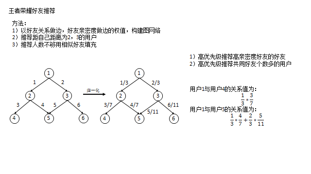

  <!--MathJax数学公式-->
  
  

## 为什么要在游戏中推荐好友？
游戏朋友之间的互动可以提高用户**活跃**和**付费**表现。在海量用户中，为用户推荐什么样的人才能增加好友互动呢？潜在的好友可能是下面几类人，

1. **可能认识的人** 真实世界的线下熟人或其他游戏的线上熟人,有互动的基础。
2. **志同道合的人** 相同的玩法偏好,相似的付费能力，共同语言，有互动的动机。

所以，游戏好友推荐就是为每个用户找到上面两类人（**预测空间**），然后科学的对潜在好友排序，使得用户添加好友的可能性最大化。

## 推荐方案

### 基于相似性的好友推荐方案
目前该方案在**smoba**好友推荐中实现，主要是根据用户人脉相似性（利用社交拓扑结构）和兴趣相似性（利用用户玩法偏好）推荐。

### 基于机器学习的好友推荐方案

此方案在**基于相似性的方案**中，添加了机器学习分类技术，这样可以利用用户的相关数据作为特征，增加了整个系统的可扩展性和潜能。具体步骤如下：

1. 预测空间：对每个用户，计算**可能认识的人**（二度好友）与**志同道合的人**（LSH），过滤掉已成对的好友，得到潜在好友集合F。
2. 标签：在**t**时刻，得到F；观察**t+1**时刻时，F中成为好友设置为1，否则设置为0.
3. 训练：得到用户基础信息和基于网络拓扑结构抽取特征，进行训练与交叉验证，调整线下模型。
4. 预测：与预测空间的逻辑一致，得到预测数据，并预测后续可能成对情况。
5. 效果验证：通过MAP，召回等手段线上验证，并进行A\B test。

## 推荐效果评估

### 好友推荐模型评估

* **精度** [P,AP,MAP](https://www.kaggle.com/wiki/MeanAveragePrecision)

	* $P(k)$是截止前k个的准确率$P(k)=\begin{cases} 0, & 第k个位置没有命中 \\\\ \frac{h}{k}, & 第k个位置命中，h是前k个位置的命中数  \end{cases}$

	* $AP = \sum_{i=1}^{n}P(k)/\min{(m,n)}$,m是所有好友数，n是预测的好友数。m是新增用户数，如果m为负数，这个用户的Ap=0。

	* $MAP = \sum_{i=1}^N AP\_i / N$,AP是每个用户的指标，MAP是AP的均值。

* **Top n准确率** 预测到正确的好友/提供的用户数

* **召回**：预测到正确的好友/真实添加的好友数

* 二元分类器评估指标
	* 召回率/准确率
	* f值
	* AUC/ROC
	* Mean Squared Error： $\frac{1}{n}\sum{(l-p)^2}$

### 好友推荐对社交关系结构评估

* 网络拓扑结构
	* 图直径
	* 图的组成：孤立点，小社群和巨片参数（参考雅虎论文(2006)Structure and Evolution of Online Social Networks）
		* 孤立点数量
		* 小社群数量，平局成员数，星形结构数量
		* 巨片点数
	* 度分布：均值，方差等
	* 网络弹性，计算方法参考fanky之前总结的资料。
	* 小世界结构
		* 平均距离：是否有缩短
		* 平均聚集系数是否增加，任意点i的聚集系数可表示为$C(i)=\frac{2|\lbrace e\_{jk}: e\_{jk} \in E, v\_j, v\_k \in N(v\_i) \rbrace|}{k\_i(k\_i-1)}$

* 游戏表现
	* 活跃时长
	* 付费金额
	* 好友互动次数和频率